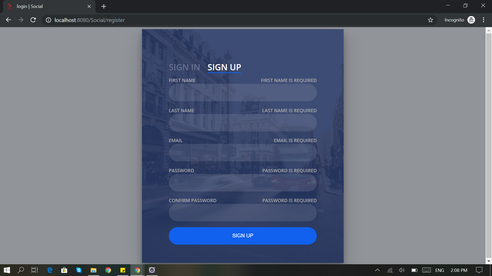
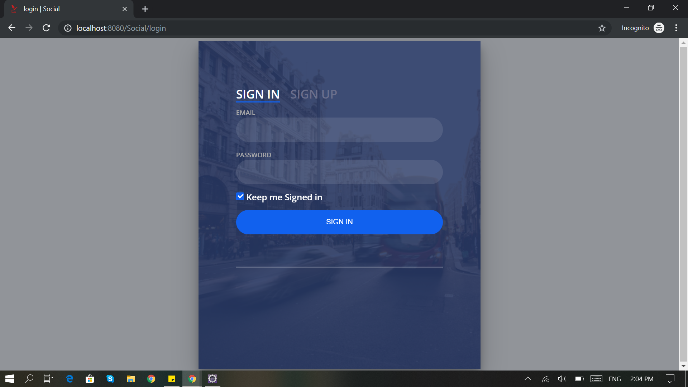
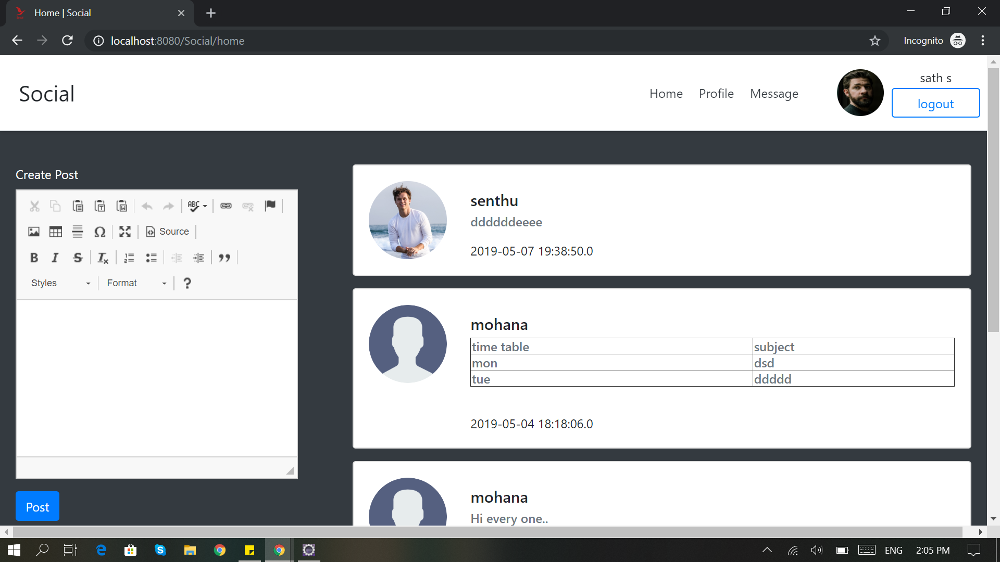
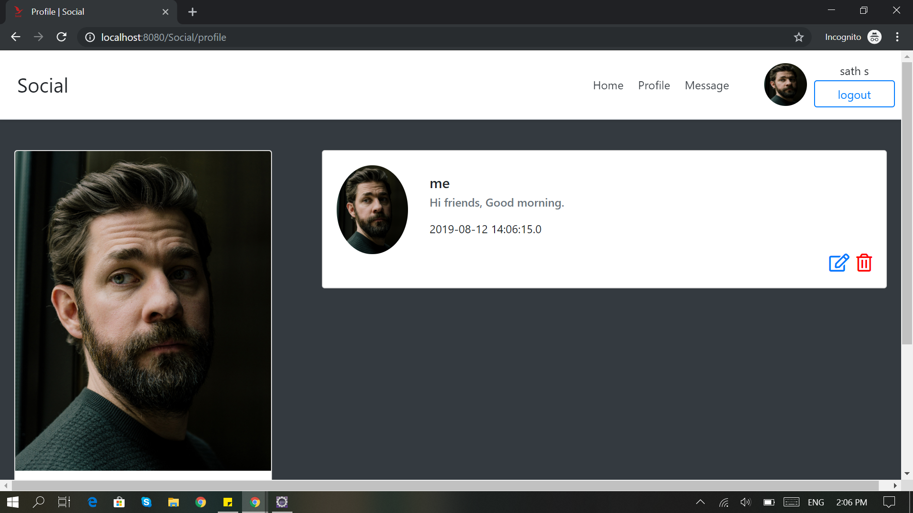
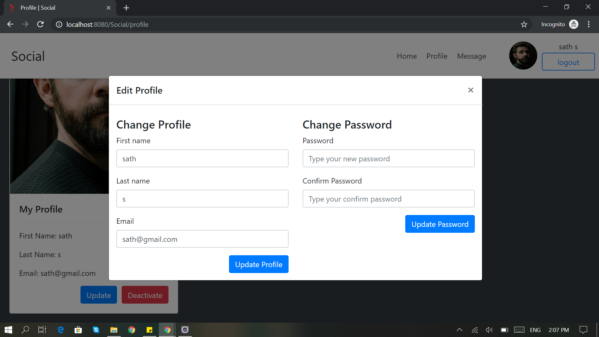
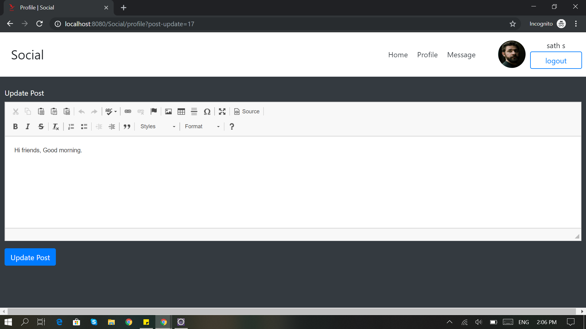
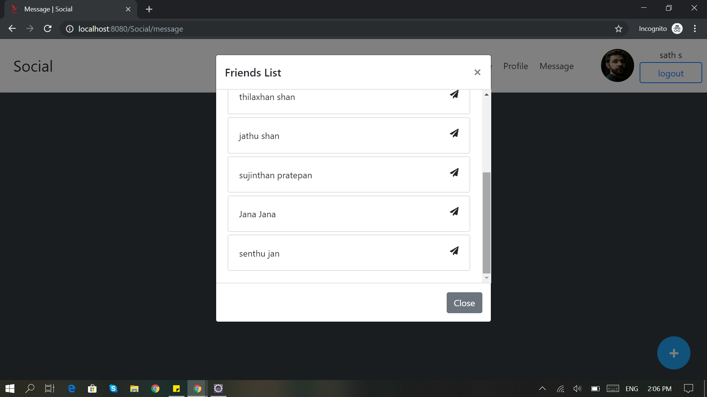
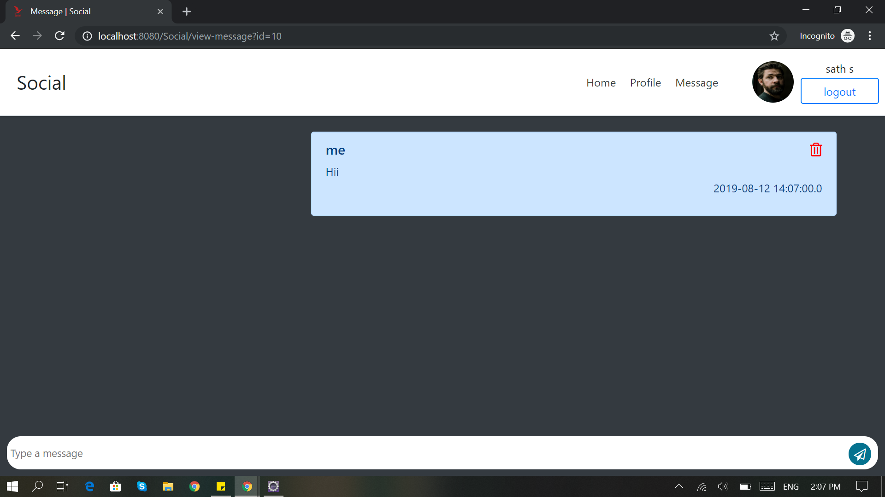
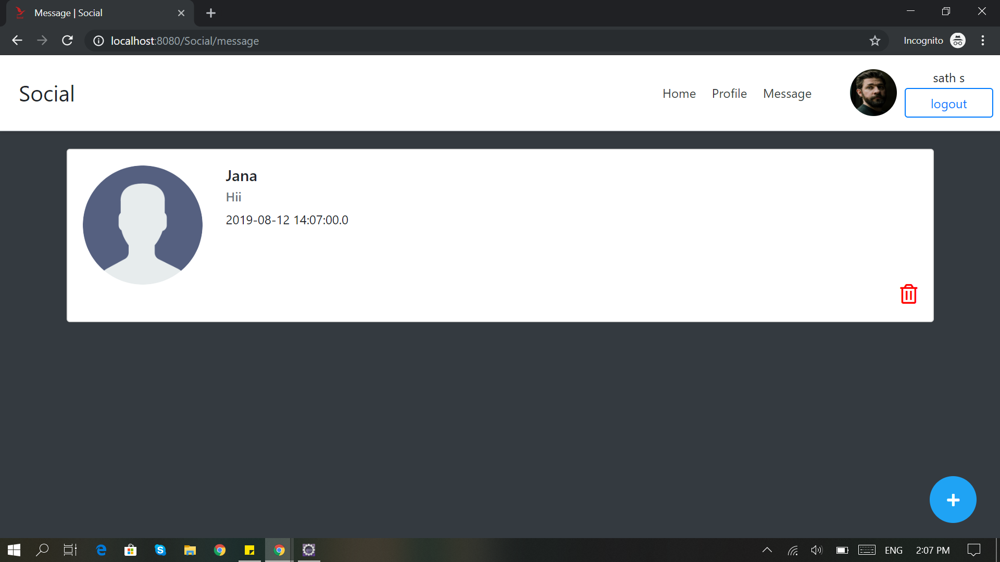

# SOCIAL APP - JAVA Servlet & JSP

```
Develop the web application like social media using JAVA Servlet & JSP. In this application, we able to view friend's post and profile, add and update own post, update own profile, and chat with friends.
```

## Method

> First, clone or download the source code from github

> Then, import the `social_db.sql` script to MySQL 

> Then, go to the `DBConnection.java`, change your connection string

```
private String url = "jdbc:mysql://localhost:3306/social_db";
private String username = "root";
private String password = "";
```

> Finally, run the application on `Apache Tomcat Server` :+1:.

## Screenshots

















